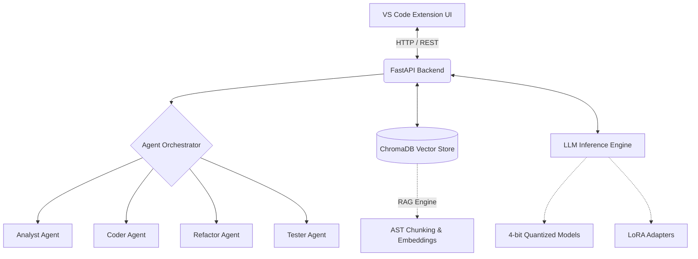

<div align="center">

# 🌌 IntelliCode Fabric

**Ультимативный локальный AI-партнер по разработке для VS Code**

[](https://code.visualstudio.com/)
[](https://python.org)
[](https://pytorch.org/)
[](https://huggingface.co/)
[](#)

[Особенности](#-ключевые-особенности) • [Архитектура](#-архитектура) • [Быстрый старт](#-быстрый-старт) • [Дообучение](#-дообучение-qlora-fine-tuning) • [Кастомные модели](#-кастомные-модели-huggingface)

</div>

## 📖 О проекте

**IntelliCode Fabric** — это продвинутый AI-ассистент разработчика, ориентированный на безопасность данных и встроенный прямо в VS Code. В отличие от облачных решений (таких как GitHub Copilot или Cursor), IntelliCode Fabric работает **на 100% локально** на вашем компьютере.

Он не просто дополняет код. Он понимает всё ваше рабочее пространство благодаря технологии **RAG**, делегирует сложные задачи **Мультиагентной системе** и даже может **дообучаться (Fine-Tuning)** под уникальный стиль написания кода в вашем проекте с помощью QLoRA.

Никаких API-ключей. Никаких подписок. Никакой телеметрии. **Ваш код никогда не покидает ваш компьютер.**

---

## ✨ Ключевые особенности

*   **📚 RAG по всему проекту:** Локально индексирует всю кодовую базу с помощью `ChromaDB`. Спросите: *"Где реализован middleware авторизации?"* — и получите точный ответ со ссылками на файлы.
*   **🤖 Мультиагентная оркестрация:** Ваши запросы автоматически маршрутизируются к специализированным AI-агентам:
    *   **🔍 Аналитик (Analyst):** Объясняет архитектуру и потоки данных.
    *   **💻 Кодер (Coder):** Пишет новые функции, учитывая контекст проекта.
    *   **🔄 Рефактор (Refactor):** Применяет паттерны проектирования (SOLID, Strategy и др.) к существующему коду.
    *   **🧪 Тестировщик (Tester):** Генерирует комплексные юнит-тесты на основе вашего фреймворка.
*   **🎯 Дообучение (Fine-Tuning) прямо в IDE:** Обучите AI специфичным правилам и стилю вашей команды через UI в VS Code. Создает легкий LoRA-адаптер (~50 МБ) без дублирования базовой модели.
*   **📥 Загрузка ЛЮБЫХ моделей с HuggingFace:** Вставьте ссылку на любой репозиторий модели с HuggingFace, и система автоматически скачает, квантует и загрузит её.
*   **⚡ Оптимизация под слабое железо:** Использует 4-битное (NF4) квантование через `bitsandbytes`. Запускайте мощные модели на 1.5B–7B параметров на обычных ноутбуках (требуется всего 3–8 ГБ оперативной/видеопамяти).
*   **✏️ Inline-редактирование кода:** Выделите код в редакторе, скажите AI, что нужно изменить, и примените готовый Diff в один клик.

---

## 🏗 Архитектура

IntelliCode Fabric разделен на легкое TypeScript-расширение для VS Code и мощный Python-бэкенд.



---

## 🚀 Быстрый старт

### Требования
*   Node.js 18+
*   Python 3.11+
*   *(Опционально, но рекомендуется)* Видеокарта NVIDIA с поддержкой CUDA

### 1. Установка и запуск бэкенда

Склонируйте репозиторий и запустите скрипт настройки для создания виртуального окружения и установки зависимостей:

**Windows:**
```bat
scripts\setup.bat
```

**Linux / macOS:**
```bash
chmod +x scripts/setup.sh
./scripts/setup.sh
```

Запустите сервер FastAPI:
```bash
source .venv/bin/activate  # (или .venv\Scripts\activate на Windows)
cd backend
python server.py
```

### 2. Запуск расширения VS Code
1. Откройте корневую папку проекта в VS Code.
2. Нажмите `F5`, чтобы запустить расширение в режиме отладки (или скомпилируйте через `npm run compile`).
3. Откройте панель **IntelliCode Fabric** в боковом меню.
4. Выберите модель (например, `Qwen2.5 Coder 1.5B`) и нажмите **Load**.
5. Нажмите **📁 Index**, чтобы просканировать ваш проект.
6. Начинайте общаться с AI!

---

## 🎯 Дообучение (QLoRA Fine-Tuning)

Устали от универсального кода, который генерирует AI? Научите модель вашему уникальному стилю.

1. Откройте ваш проект в VS Code.
2. В боковой панели IntelliCode Fabric нажмите кнопку **🎯 Fine-tune**.
3. Выберите базовую модель, укажите количество эпох (до 100) и выберите стратегии извлечения данных (например, *Докстринг → Реализация*, *Комментарий → Код*).
4. Нажмите **Start Fine-tuning**.
5. После завершения загрузите свежесозданный **Адаптер** из выпадающего меню моделей. Теперь ваш AI разговаривает на диалекте вашего проекта!

---

## 🌐 Кастомные модели HuggingFace

Вы не ограничены моделями по умолчанию.
1. Зайдите на [HuggingFace](https://huggingface.co/models).
2. Найдите любую code-модель (например, `microsoft/Phi-3-mini-4k-instruct`).
3. Вставьте имя репозитория в поле ввода кастомной модели в боковой панели.
4. Нажмите **Add**. Система скачает модель, применит 4-битное квантование и добавит её в вашу локальную библиотеку.

---

## ⚖️ Сравнение аналогов

| Характеристика | IntelliCode Fabric | GitHub Copilot | Cursor |
| :--- | :---: | :---: | :---: |
| **100% Локально (Оффлайн)** | ✅ Да | ❌ Нет | ❌ Нет |
| **Конфиденциальность данных**| 💯 Абсолютная | ⚠️ Отправка в облако | ⚠️ Отправка в облако |
| **RAG по всему проекту** | ✅ Глубокий AST чанкинг| ⚠️ Ограниченно | ✅ Да |
| **Дообучение прямо в IDE** | ✅ Да (QLoRA) | ❌ Только Enterprise | ❌ Нет |
| **Свои (кастомные) модели** | ✅ Любая модель с HF | ❌ Заблокировано | ❌ Только облачные |
| **Стоимость** | **Бесплатно (Open Source)** | $10 / месяц | $20 / месяц |

---

## 🛠 Стек технологий

*   **Frontend:** TypeScript, VS Code Extension API, Vanilla JS/CSS (Dark Industrial Theme).
*   **Backend:** Python, FastAPI, Uvicorn.
*   **AI / ML:** PyTorch, HuggingFace `transformers`, `trl` (SFTTrainer), `peft` (LoRA), `bitsandbytes` (NF4 Quantization).
*   **Векторная БД:** `ChromaDB` с использованием `sentence-transformers`.

---

## 📄 Лицензия

Распространяется под лицензией Apache. Подробности см. в файле `LICENSE`.

---
<div align="center">
<i>Создано для инженеров, которым важна мощность, автономность и абсолютная приватность кода.</i>
</div>